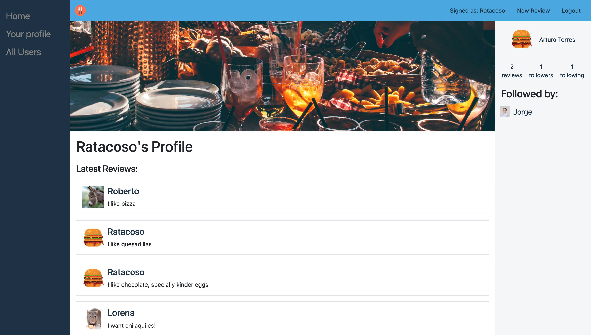

# Rails Project - Food Reviews App 

>  In this project I built an app to give opinions about food and food related things, it has a functionality like Tweeter, where you can post an opinion or review on a feed that every user is able to see. Each user is able to post reviews, and follow or unfollow other users, see their profiles and check the profile of other users to see their statistics, like number of reviews, number of followers and number of users followed by that user.
## Screenshot

## Built With

- Ruby v2.7.2
- Ruby on Rails v6.0.3.4
- Bootstrap
- Cloudinary
- VSCode

## Live Demo

https://fathomless-citadel-51226.herokuapp.com/users/sign_in

### Prerequisites

Ruby: 2.7.2
Rails: 6.0.3.4
Postgres: >=9.5

### Instructions To Setup Application

1. - Run `git clone git@github.com:Yors-git/food-social-network.git` to download 
4. - Run `bundle install` to install Ruby Gems
6. - Run `rails db:create` to create a local database
7. - Run `rails db:migrate` to migrate the database
8. - Run `rails s`
8. - Run `http://localhost:3000/` in your browser to start the application

## Author:

### 👨‍💻 Jorge Torres

- Github: [Jorge Torres](https://github.com/Yors-git)
- Linkedin: [Jorge Torres](https://www.linkedin.com/in/jtbribiesca/)
- Twitter: [@Yors_82](https://twitter.com/Yors_82)

## 🤝 Contributing

Contributions, issues and feature requests are welcome!

Feel free to check the [issues page](issues/).

## Show your support

Give a ⭐️ if you like this project!

## Acknowledgments

- Design idea by [Gregoire Vella](https://www.behance.net/gregoirevella)

## 📝 License

This is a Microverse project, all rights reserved to Jorge Torres
